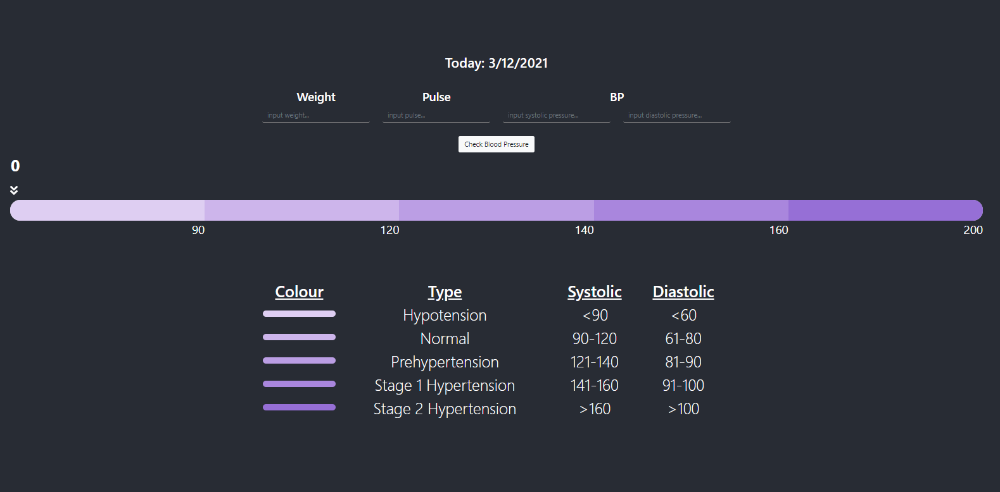
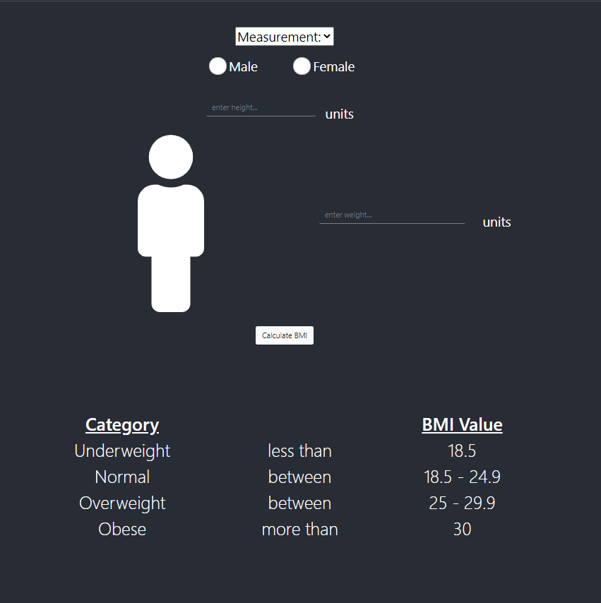
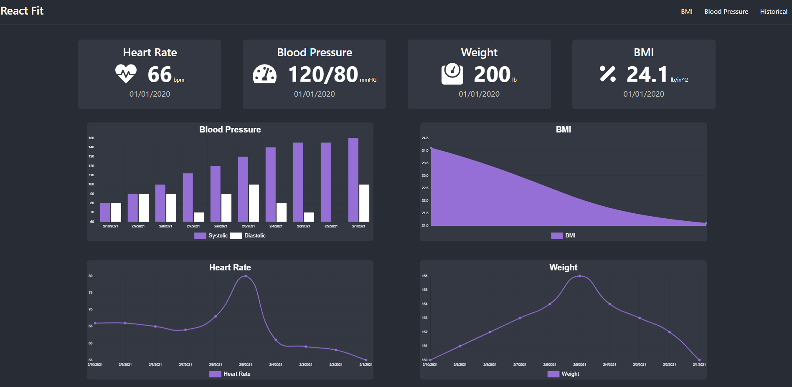

This project was bootstrapped with [Create React App](https://github.com/facebook/create-react-app).

## Project React Fit

### Info
The following project is a front end project built in React that allows users to be able to calculate their BMI and as well as their blood pressure.

### demo
https://andrewh-code.github.io/react-fit/

### Tech Stack
This website was built using the following tech stack

#### Front-End
- React + JSX
    - Create-React-App
- HTML
- CSS
- JavaScript 
- Bootstrap

### How To run:

- pretty much the same commands you would run in the create-react-app
    - `npm run start`
- front end is hosted ont he default front end React port: 3000

### Screenshots

